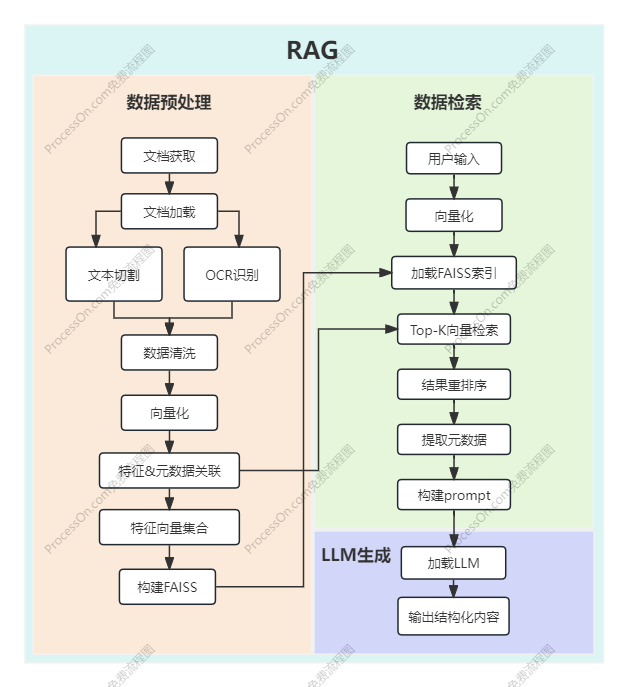

# **LLM_Wireless_Communication_Expert**

🎯**实现功能：**
1. 回答通信领域知识

🚩**实现步骤:**
1. 获取通信知识文档：3GPP协议、通信电子书
2. 文档读取，数据清洗（用正则），向量化
3. 构建通信RAG知识库
4. 根据通信场景，设计提问Propmt、模版
5. 进行微调，使得模型回答更像通信专家
6. 增加通信公式计算，将一些公式封装为函数，根据提示以及给定参数进行计算

## 系统框图

## 一、构建通信知识库
1. 收集文档：
收集常用3GPP协议以及通信电子书
2. 文档读取：
对于docs，用...读取
对于pdf，用...读取
3. 数据清洗：
